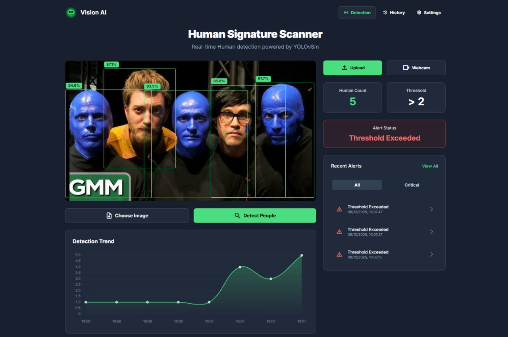
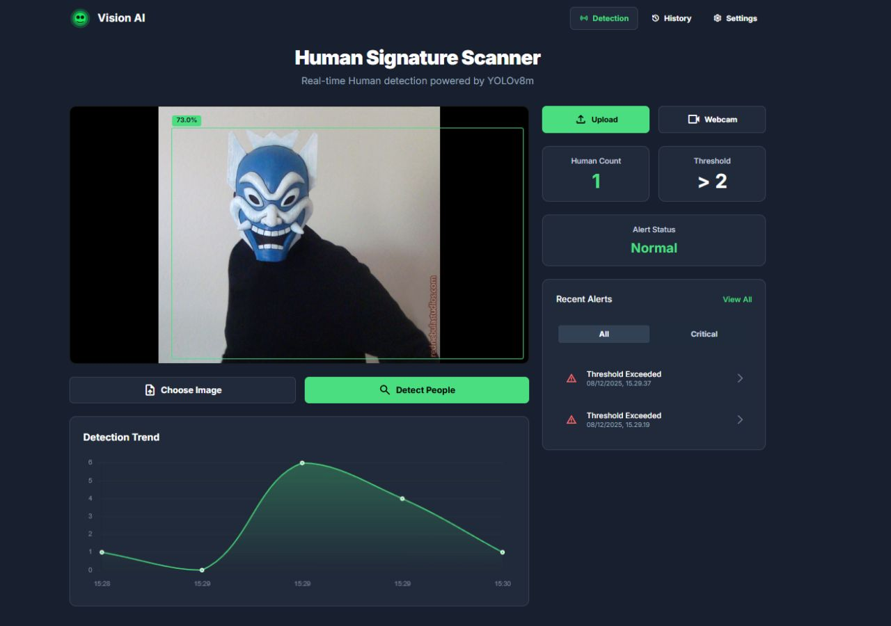
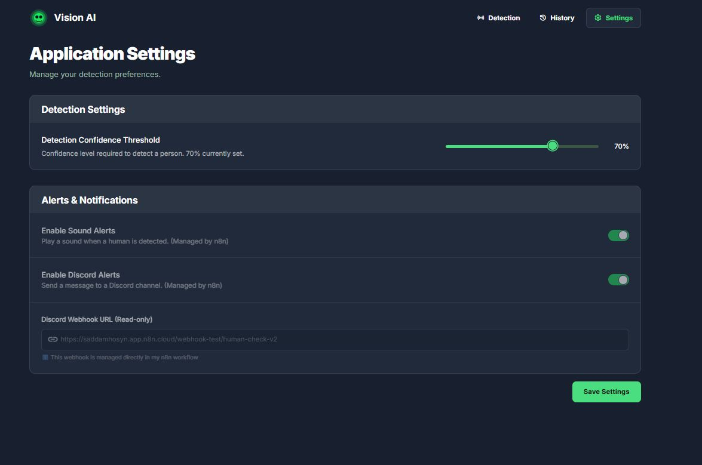
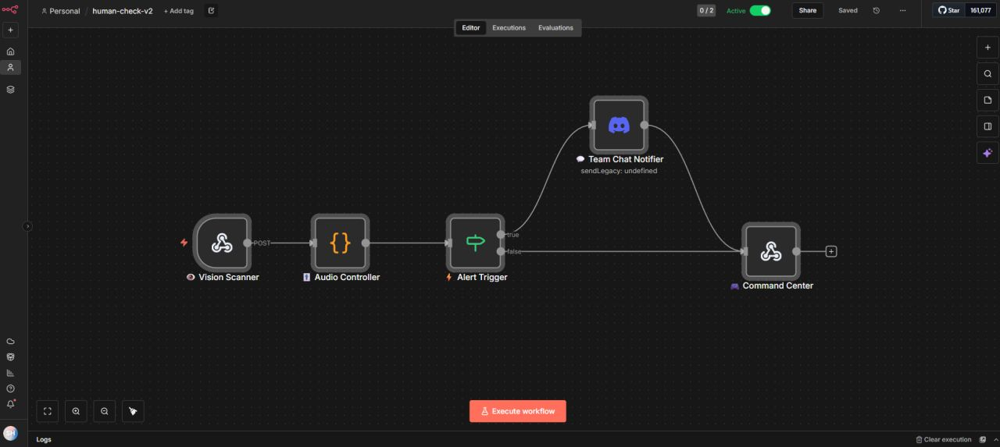
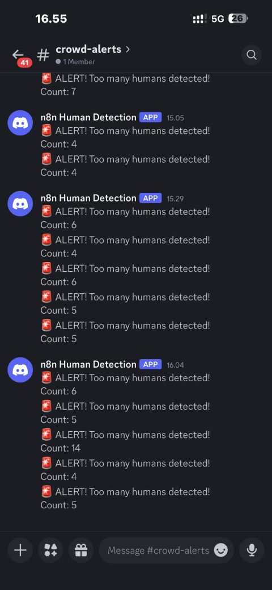

# Detecto - Real-Time Person Detection & Counting System

Detecto is an automation and safety application that monitors spaces by detecting and counting people in a given frame. It features a modern **React** frontend and a **FastAPI** backend powered by a **YOLOv8** model for robust, real-time computer vision capabilities.

## Features

- **Person Detection**: Accurate person detection using a pretrained YOLOv8 model.
- **Visual Overlays**: Displays bounding boxes and confidence scores over detected individuals.
- **Analytics & History**: Logs detections including timestamps, total counts, and average confidence for tracking over time.
- **Export & Filtering**: View and export historical detection data via the dashboard.
- **Responsive Dashboard**: A seamless UI built with React to upload images or process video streams.

## Technology Stack

- **Backend**: FastAPI, Python, YOLOv8, OpenCV
- **Frontend**: React, Tailwind CSS
- **Data Storage**: JSON / Local Storage

## Getting Started

### Prerequisites

- Node.js (v14+)
- Python 3.8+

### Setup the Backend

1. Navigate to the backend directory:
   ```bash
   cd backend
   ```
2. Set up a Python virtual environment and activate it:
   ```bash
   python -m venv venv
   source venv/Scripts/activate # On Windows
   # source venv/bin/activate # On macOS/Linux
   ```
3. Install the required packages:
   ```bash
   pip install -r ../requirements.txt
   ```
4. Start the FastAPI server:
   ```bash
   uvicorn main:app --reload --port 8000
   ```

### Setup the Frontend

1. Navigate to the frontend directory:
   ```bash
   cd frontend
   ```
2. Install dependencies:
   ```bash
   npm install
   ```
3. Start the React development server:
   ```bash
   npm start
   ```

## API Endpoints

- `POST /detect`: Accepts an image, runs inference, and returns JSON indicating the number of people, confidence scores, bounding boxes, and the dynamically rendered image (base64).
- `GET /history`: Retrieves recent and historical detection data from storage.
- `POST /settings` / `GET /settings`: Manage application configurations or resets.

## Evaluation Metrics

Target performance metrics for the Detecto system (as tested on sample images):

| Metric                 | Description                                | Target |
| ---------------------- | ------------------------------------------ | ------ |
| Detection Accuracy     | Correct detections ÷ total visible persons | ≥ 85%  |
| False Positives        | Non-person detections                      | ≤ 10%  |
| Average Inference Time | Time per image (local GPU/CPU)             | ≤ 1.5s |
| Average Confidence     | Mean confidence of valid detections        | ≥ 0.7  |
| System Reliability     | Handles all test images without crashing   | 100%   |

## Screenshots

Below is a showcase of the Detecto system in action.

<details>
  <summary><strong>1. Detection Dashboard (Normal Status)</strong></summary>
  
  <br>
  
</details>

<details>
  <summary><strong>2. Detection Dashboard (Alert Status)</strong></summary>
  
  <br>
  
</details>

<details>
  <summary><strong>3. Detection History Logs</strong></summary>
  
  <br>
  
</details>

<details>
  <summary><strong>4. Application Settings</strong></summary>
  
  <br>
  
</details>

<details>
  <summary><strong>5. Notification Pipeline (n8n & Discord)</strong></summary>
  
  <br>
  
  <br>
  
</details>

## License

This project is open-source and ready for extension.
